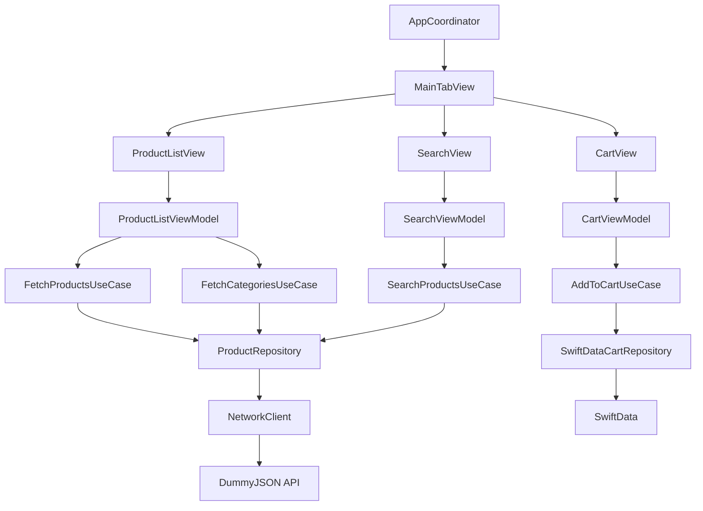

//
//  README.md
//  MiniMart
//
//  Created by Venkatesh on 6/6/26.
//

# MiniMart 🛒

An iOS e-commerce demo app built with modern Swift,
showcasing production-level architecture patterns.

## Architecture

MVVM-C + Clean Architecture



## Tech Stack

| Layer | Technology |
|-------|-----------|
| UI | SwiftUI |
| Architecture | MVVM-C + Clean Architecture |
| Async | async/await + Combine |
| Storage | SwiftData |
| Caching | Actor-based NSCache |
| Modular | Swift Package Manager |
| Testing | Swift Testing |

## Features

- 🛍️ Product listing with category filter
- 🔍 Search with Combine debounce
- 🛒 Cart with SwiftData persistence
- 🖼️ Thread-safe image caching (Actor)
- 🚀 Parallel API loading (async let)
- 🎛️ Feature flags system
- 📊 Protocol-based telemetry
- 🧪 Unit tests (Swift Testing)
- 📦 Modular SPM architecture

## Modules

```
MiniMartCore (Swift Package)
├── Models/     → Product, Category
├── Network/    → NetworkClient, ProductRepository
└── Cache/      → ImageCache actor, CachedAsyncImage

MiniMart (App Target)
├── App/        → AppCoordinator, MainTabView
├── Features/   → ProductList, ProductDetail, Search, Cart
├── Core/       → UseCases, Storage, Analytics, FeatureFlags
└── Tests/      → Swift Testing unit tests
```

## Key Technical Decisions

**async let for parallel loading**
Products and categories fetched simultaneously,
reducing load time vs sequential fetching.

**Actor-based ImageCache**
NSCache wrapped in Swift actor prevents data races
when multiple views load images concurrently.

**Protocol-based analytics**
Telemetry abstracted behind protocol — swap
ConsoleAnalyticsService for Firebase with zero
feature code changes.

**@Observable over ObservableObject**
Used iOS 17 @Observable for ViewModels
(except SearchViewModel which needs Combine $publisher).

## Instruments Results

- ✅ Thermal: Nominal
- ✅ Full Hangs: 0
- ⚠️ Microhang: 1 × 315ms (startup, JSON decode)
- ✅ Memory: No leaks detected

## Requirements

- iOS 17+
- Xcode 26+
- Swift 5.9+
